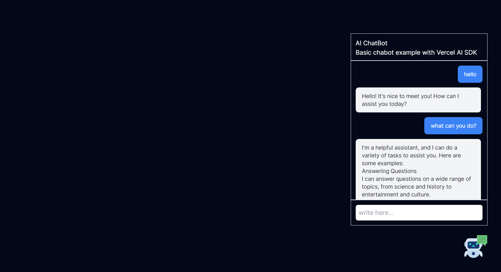

# Basic ChatBot Example

Basic ChatBot setup with Next.js and Vercel AI SDK using the OpenAI - ChatGPT Model

---

## 

## Install The node modules

- run `npm install`

## Run the app

- run `npm run dev`

## Environment variables

- Create a `.env` file and copy the conent from `.env.example` to this file
- `GROQ_API_KEY` - Get your groq API key from [Groq Console](https://console.groq.com/)
